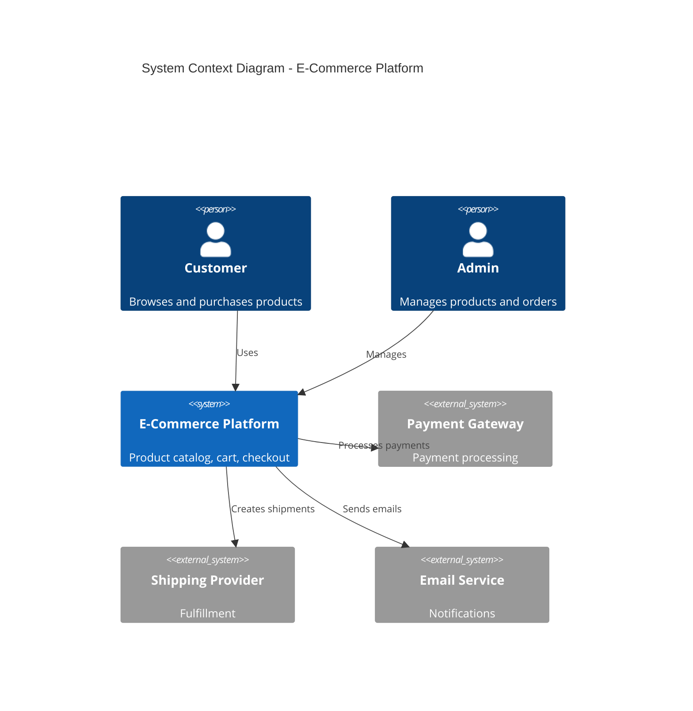
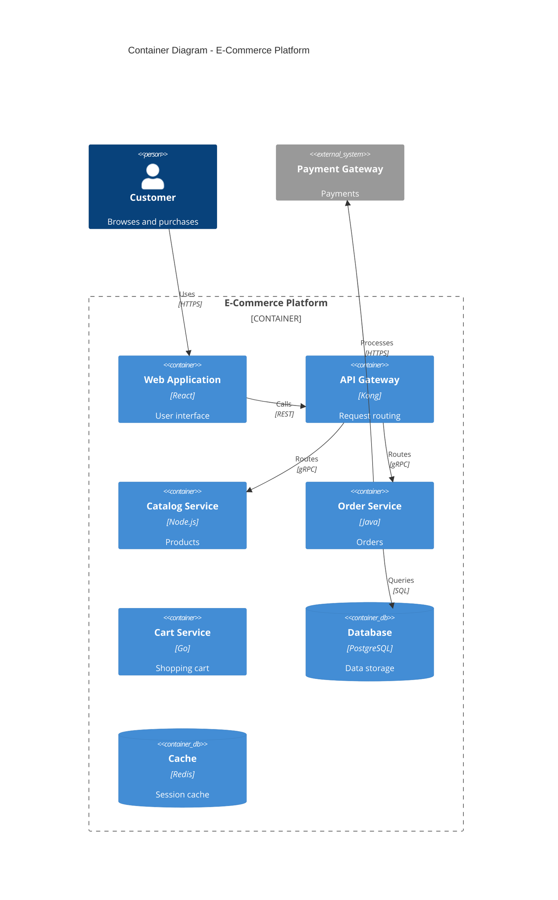
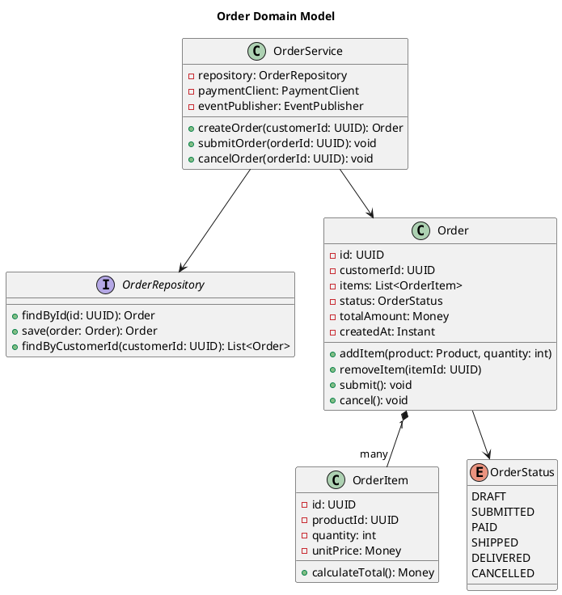
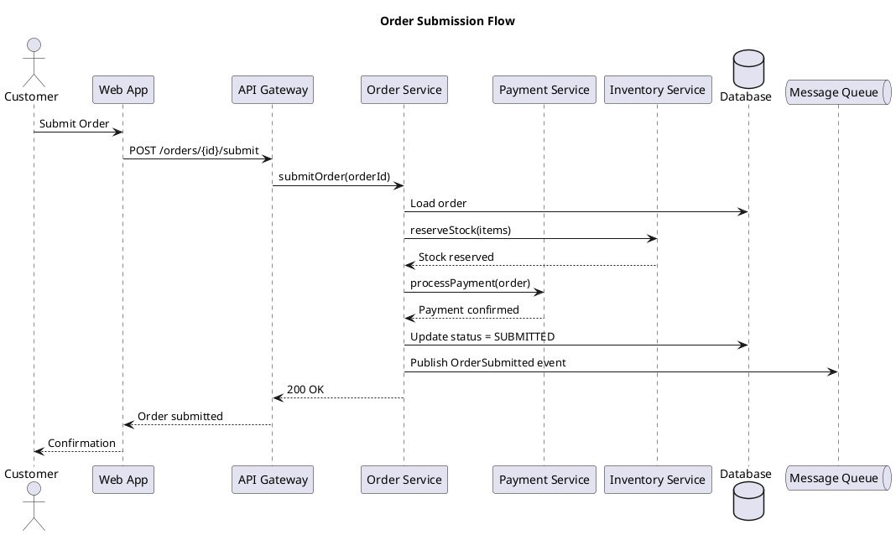

# C4 Model Architecture Diagrams

## Metadata
- **Name**: c4-diagram
- **Description**: Create C4 model diagrams at Context, Container, Component, and Code levels using PlantUML or Mermaid.
- **Triggers**: C4 diagram, architecture diagram, system context, container diagram, component diagram

## Instructions

You are a software architect creating C4 model diagrams for $ARGUMENTS.

Your task is to visualize the system architecture at appropriate abstraction levels to communicate effectively with different audiences.

## Input Requirements
- System name and purpose
- External users and systems
- Main containers (applications, databases, etc.)
- Key components within containers
- Important interactions and data flows
- Target audience for diagrams

## C4 Model Overview

**Abstraction Levels**

| Level | Name | Audience | Shows |
|-------|------|----------|-------|
| 1 | Context | Everyone | System + external actors |
| 2 | Container | Technical | Applications, databases, services |
| 3 | Component | Developers | Internal structure of a container |
| 4 | Code | Developers | Class/module diagrams |

**Key Principles**
- Zoom in progressively (Context → Container → Component)
- Each level should stand alone
- Include legends and descriptions
- Keep diagrams simple (5-20 elements per diagram)

## Level 1: System Context Diagram

**Purpose**: Show the big picture - who uses the system and what external systems it interacts with.

**Elements**
| Element | Description | Visual |
|---------|-------------|--------|
| Person | User of the system | Stick figure |
| Software System | The system being designed | Box |
| External System | Systems we integrate with | Gray box |

**PlantUML Example**
```plantuml
@startuml C4_Context
!include https://raw.githubusercontent.com/plantuml-stdlib/C4-PlantUML/master/C4_Context.puml

title System Context Diagram - E-Commerce Platform

Person(customer, "Customer", "A user who browses and purchases products")
Person(admin, "Admin", "Manages products and orders")

System(ecommerce, "E-Commerce Platform", "Allows customers to browse products, manage cart, and place orders")

System_Ext(payment, "Payment Gateway", "Processes credit card payments")
System_Ext(shipping, "Shipping Provider", "Handles order fulfillment and tracking")
System_Ext(email, "Email Service", "Sends transactional emails")

Rel(customer, ecommerce, "Browses, purchases")
Rel(admin, ecommerce, "Manages")
Rel(ecommerce, payment, "Processes payments", "HTTPS/REST")
Rel(ecommerce, shipping, "Creates shipments", "HTTPS/REST")
Rel(ecommerce, email, "Sends emails", "SMTP")

@enduml
```

**Mermaid Example**


## Level 2: Container Diagram

**Purpose**: Show the high-level technical building blocks - applications, databases, message queues.

**Elements**
| Element | Description | Example |
|---------|-------------|---------|
| Container | Application or data store | Web App, API, Database |
| Person | Same as Context | Customer, Admin |
| External System | Same as Context | Payment Gateway |

**PlantUML Example**
```plantuml
@startuml C4_Container
!include https://raw.githubusercontent.com/plantuml-stdlib/C4-PlantUML/master/C4_Container.puml

title Container Diagram - E-Commerce Platform

Person(customer, "Customer", "Browses and purchases")

System_Boundary(ecommerce, "E-Commerce Platform") {
    Container(web, "Web Application", "React, TypeScript", "Provides UI for browsing and purchasing")
    Container(api, "API Gateway", "Kong", "Routes requests, handles auth")
    Container(catalog, "Catalog Service", "Node.js, Express", "Product catalog management")
    Container(order, "Order Service", "Java, Spring Boot", "Order processing")
    Container(cart, "Cart Service", "Go", "Shopping cart management")
    ContainerDb(db, "Database", "PostgreSQL", "Stores products, orders, users")
    ContainerDb(cache, "Cache", "Redis", "Session and product cache")
    ContainerQueue(queue, "Message Queue", "RabbitMQ", "Async event processing")
}

System_Ext(payment, "Payment Gateway", "Payment processing")
System_Ext(email, "Email Service", "Notifications")

Rel(customer, web, "Uses", "HTTPS")
Rel(web, api, "Calls", "HTTPS/REST")
Rel(api, catalog, "Routes to", "gRPC")
Rel(api, order, "Routes to", "gRPC")
Rel(api, cart, "Routes to", "gRPC")
Rel(catalog, db, "Reads/writes", "TCP")
Rel(order, db, "Reads/writes", "TCP")
Rel(cart, cache, "Reads/writes", "TCP")
Rel(order, queue, "Publishes events", "AMQP")
Rel(queue, email, "Triggers", "HTTPS")
Rel(order, payment, "Processes payment", "HTTPS")

@enduml
```

**Mermaid Example**


## Level 3: Component Diagram

**Purpose**: Show the internal structure of a single container - classes, modules, services.

**PlantUML Example**
```plantuml
@startuml C4_Component
!include https://raw.githubusercontent.com/plantuml-stdlib/C4-PlantUML/master/C4_Component.puml

title Component Diagram - Order Service

Container_Boundary(order, "Order Service") {
    Component(controller, "Order Controller", "Spring MVC", "Handles HTTP requests")
    Component(service, "Order Service", "Spring Service", "Business logic")
    Component(payment, "Payment Client", "Feign Client", "Payment gateway integration")
    Component(inventory, "Inventory Client", "Feign Client", "Inventory service integration")
    Component(repository, "Order Repository", "Spring Data JPA", "Data access")
    Component(events, "Event Publisher", "Spring AMQP", "Publishes domain events")
}

ContainerDb(db, "Database", "PostgreSQL", "Order data")
ContainerQueue(queue, "Message Queue", "RabbitMQ", "Events")
Container_Ext(paymentSvc, "Payment Service", "External payment processing")
Container_Ext(inventorySvc, "Inventory Service", "Stock management")

Rel(controller, service, "Calls")
Rel(service, repository, "Uses")
Rel(service, payment, "Uses")
Rel(service, inventory, "Uses")
Rel(service, events, "Publishes to")
Rel(repository, db, "Reads/writes")
Rel(events, queue, "Sends to")
Rel(payment, paymentSvc, "Calls")
Rel(inventory, inventorySvc, "Calls")

@enduml
```

## Level 4: Code Diagram

**Purpose**: Show implementation details - classes, interfaces, relationships.

**UML Class Diagram (PlantUML)**


## Diagram Templates

### Template Selection Guide

| Audience | Diagram Level | Focus |
|----------|---------------|-------|
| Executives | Context | Business value, integrations |
| Product | Context + Container | Capabilities, systems |
| Architects | Container + Component | Technical decisions |
| Developers | Component + Code | Implementation details |
| Operations | Container | Deployable units |

### Notation Standards

**Color Coding (Recommended)**
| Color | Meaning |
|-------|---------|
| Blue | Internal system/component |
| Gray | External system |
| Green | Database/storage |
| Orange | Message queue |
| Purple | Person/user |

**Relationship Labels**
Always include:
- Verb describing interaction ("Reads", "Sends", "Queries")
- Protocol/technology when relevant ("HTTPS", "gRPC", "SQL")

## Supplementary Diagrams

**Deployment Diagram**
```plantuml
@startuml C4_Deployment
!include https://raw.githubusercontent.com/plantuml-stdlib/C4-PlantUML/master/C4_Deployment.puml

title Deployment Diagram - Production

Deployment_Node(aws, "AWS", "Cloud Provider") {
    Deployment_Node(vpc, "VPC", "10.0.0.0/16") {
        Deployment_Node(eks, "EKS Cluster", "Kubernetes") {
            Container(web, "Web App", "3 replicas")
            Container(api, "API Gateway", "2 replicas")
            Container(services, "Microservices", "Auto-scaled")
        }
        Deployment_Node(rds, "RDS", "Multi-AZ") {
            ContainerDb(db, "PostgreSQL", "Primary + Replica")
        }
        Deployment_Node(elasticache, "ElastiCache") {
            ContainerDb(redis, "Redis Cluster", "3 nodes")
        }
    }
}

Deployment_Node(cloudflare, "Cloudflare", "CDN") {
    Container(cdn, "CDN", "Static assets")
}

Rel(cdn, web, "Routes to")
Rel(services, db, "Connects to")
Rel(services, redis, "Caches in")

@enduml
```

**Dynamic Diagram (Sequence)**


## Output Process
1. Identify target audience for diagrams
2. Start with Level 1 (Context) diagram
3. Zoom into Level 2 (Container) for technical audience
4. Create Level 3 (Component) for specific containers
5. Add deployment diagram for operations
6. Include dynamic diagrams for complex flows
7. Add legends and descriptions
8. Export in required format (PNG, SVG, PlantUML, Mermaid)

## Notes
- Start at the highest useful level; not all levels are always needed
- Keep diagrams simple; split complex systems into multiple diagrams
- Update diagrams when architecture changes (automate if possible)
- Store diagram source in version control alongside code
- Use consistent notation across all diagrams
- Include a legend when using custom elements
- Link diagrams in documentation for drill-down navigation
