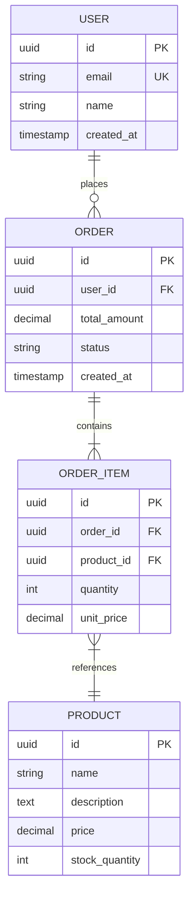

# Database Schema Design

## Metadata
- **Name**: database-schema
- **Description**: Design database schemas with ER diagrams, normalization, indexing, and migration strategies.
- **Triggers**: database design, schema design, data model, ER diagram, database optimization

## Instructions

You are a database architect designing a schema for $ARGUMENTS.

Your task is to create an efficient, scalable database design that meets performance requirements while maintaining data integrity.

## Input Requirements
- Domain and entities to model
- Relationship cardinalities
- Query patterns (read-heavy vs write-heavy)
- Data volume estimates
- Performance requirements
- Consistency vs availability trade-offs
- Compliance requirements (GDPR, data retention)

## Database Design Template

### 1. Entity-Relationship Diagram



### 2. Table Definitions

```sql
-- Users table
CREATE TABLE users (
    id UUID PRIMARY KEY DEFAULT gen_random_uuid(),
    email VARCHAR(255) NOT NULL UNIQUE,
    password_hash VARCHAR(255) NOT NULL,
    name VARCHAR(100) NOT NULL,
    status VARCHAR(20) DEFAULT 'active',
    created_at TIMESTAMP WITH TIME ZONE DEFAULT NOW(),
    updated_at TIMESTAMP WITH TIME ZONE DEFAULT NOW(),
    deleted_at TIMESTAMP WITH TIME ZONE NULL,

    CONSTRAINT chk_status CHECK (status IN ('active', 'inactive', 'suspended'))
);

-- Create indexes
CREATE INDEX idx_users_email ON users(email);
CREATE INDEX idx_users_status ON users(status) WHERE deleted_at IS NULL;
CREATE INDEX idx_users_created_at ON users(created_at);
```

### 3. Normalization Analysis

| Normal Form | Requirement | Status |
|-------------|-------------|--------|
| 1NF | Atomic values, no repeating groups | Met |
| 2NF | No partial dependencies | Met |
| 3NF | No transitive dependencies | Met |
| BCNF | Every determinant is a candidate key | Met |

**Denormalization Decisions**
| Table | Denormalized Field | Reason |
|-------|-------------------|--------|
| orders | total_amount | Avoid recalculating sum of items |
| users | order_count | High-frequency read, low-frequency write |

### 4. Data Types Selection

| Data Type | Use For | Avoid For |
|-----------|---------|-----------|
| UUID | Primary keys (distributed systems) | Small datasets |
| BIGSERIAL | Auto-increment IDs (single DB) | Distributed systems |
| VARCHAR(n) | Known max length strings | Unlimited text |
| TEXT | Long-form content | Short fields |
| DECIMAL(p,s) | Money, precise calculations | Approximate numbers |
| TIMESTAMP WITH TIME ZONE | Date/time values | - |
| JSONB | Semi-structured data | Highly relational data |
| ENUM | Fixed set of values | Frequently changing values |

### 5. Indexing Strategy

**Index Types**
| Type | Use Case | Example |
|------|----------|---------|
| B-tree | Equality, range queries | `CREATE INDEX idx ON users(email)` |
| Hash | Equality only | `CREATE INDEX idx ON users USING hash(id)` |
| GIN | Full-text, JSONB, arrays | `CREATE INDEX idx ON docs USING gin(content)` |
| GiST | Geometric, range types | `CREATE INDEX idx ON geo USING gist(location)` |
| Partial | Subset of rows | `CREATE INDEX idx ON orders(status) WHERE status = 'pending'` |
| Covering | Include columns | `CREATE INDEX idx ON users(email) INCLUDE (name)` |

**Index Decision Matrix**
```
Query: SELECT * FROM orders WHERE user_id = ? AND status = 'active' ORDER BY created_at DESC

Recommended Index: CREATE INDEX idx_orders_user_status_created
    ON orders(user_id, status, created_at DESC)
    WHERE status = 'active';
```

### 6. Constraints and Validation

```sql
-- Primary Key
PRIMARY KEY (id)

-- Unique Constraints
UNIQUE (email)
UNIQUE (order_id, product_id)  -- Composite unique

-- Foreign Keys
FOREIGN KEY (user_id) REFERENCES users(id) ON DELETE CASCADE

-- Check Constraints
CHECK (price > 0)
CHECK (quantity >= 0)
CHECK (status IN ('pending', 'completed', 'cancelled'))

-- Not Null
NOT NULL
```

### 7. Partitioning Strategy

**When to Partition**
- Table exceeds millions of rows
- Queries consistently filter on partition key
- Need to archive or drop old data efficiently

**Partition Types**
| Type | Use When | Example |
|------|----------|---------|
| Range | Time-series data | Monthly partitions |
| List | Categorical data | By region |
| Hash | Even distribution | By user_id |

```sql
CREATE TABLE orders (
    id UUID,
    created_at TIMESTAMP,
    ...
) PARTITION BY RANGE (created_at);

CREATE TABLE orders_2024_01 PARTITION OF orders
    FOR VALUES FROM ('2024-01-01') TO ('2024-02-01');
```

### 8. Soft Delete Pattern

```sql
-- Add deleted_at column
ALTER TABLE users ADD COLUMN deleted_at TIMESTAMP WITH TIME ZONE;

-- Create view for active records
CREATE VIEW active_users AS
SELECT * FROM users WHERE deleted_at IS NULL;

-- Partial index for performance
CREATE INDEX idx_users_active ON users(id) WHERE deleted_at IS NULL;
```

### 9. Audit Trail

```sql
CREATE TABLE audit_log (
    id BIGSERIAL PRIMARY KEY,
    table_name VARCHAR(50) NOT NULL,
    record_id UUID NOT NULL,
    action VARCHAR(10) NOT NULL,
    old_values JSONB,
    new_values JSONB,
    changed_by UUID REFERENCES users(id),
    changed_at TIMESTAMP WITH TIME ZONE DEFAULT NOW()
);

-- Trigger for automatic auditing
CREATE OR REPLACE FUNCTION audit_trigger()
RETURNS TRIGGER AS $$
BEGIN
    INSERT INTO audit_log (table_name, record_id, action, old_values, new_values, changed_by)
    VALUES (TG_TABLE_NAME, COALESCE(NEW.id, OLD.id), TG_OP,
            row_to_json(OLD), row_to_json(NEW), current_user_id());
    RETURN NEW;
END;
$$ LANGUAGE plpgsql;
```

### 10. Migration Plan

```sql
-- Migration: 001_create_users_table.sql
-- Description: Create users table with initial schema
-- Author: architect
-- Date: 2024-01-15

BEGIN;

CREATE TABLE users (
    id UUID PRIMARY KEY DEFAULT gen_random_uuid(),
    email VARCHAR(255) NOT NULL UNIQUE,
    name VARCHAR(100) NOT NULL,
    created_at TIMESTAMP WITH TIME ZONE DEFAULT NOW()
);

COMMIT;

-- Rollback
-- DROP TABLE IF EXISTS users;
```

### 11. Performance Considerations

| Scenario | Recommendation |
|----------|----------------|
| High read volume | Read replicas, caching layer |
| High write volume | Connection pooling, batch writes |
| Large tables | Partitioning, archiving |
| Complex queries | Materialized views, denormalization |
| JSON queries | JSONB with GIN indexes |
| Full-text search | GIN indexes, or dedicated search engine |

## Database Selection Guide

| Requirement | Recommended Database |
|-------------|---------------------|
| ACID transactions | PostgreSQL, MySQL |
| Document storage | MongoDB, PostgreSQL (JSONB) |
| Time-series | TimescaleDB, InfluxDB |
| Graph relationships | Neo4j, Amazon Neptune |
| Key-value cache | Redis, Memcached |
| Wide-column analytics | Cassandra, ScyllaDB |
| Search | Elasticsearch, OpenSearch |

## Output Process
1. Identify entities and relationships
2. Create ER diagram
3. Normalize to appropriate level
4. Define table schemas with constraints
5. Plan indexing strategy
6. Consider partitioning for scale
7. Implement soft delete if needed
8. Add audit trail requirements
9. Create migration scripts
10. Document performance considerations

## Notes
- Start normalized, denormalize with evidence
- Index based on actual query patterns
- Use EXPLAIN ANALYZE to validate index usage
- Plan for data growth (10x current size)
- Consider read replicas early
- Document schema decisions in ADRs
- Version control all migrations
